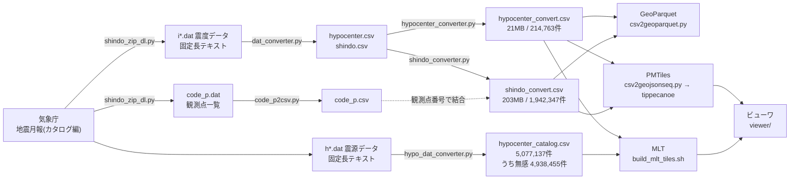

# jma-earthquake-data-converter

気象庁 [地震月報(カタログ編)](https://www.data.jma.go.jp/eqev/data/bulletin/shindo.html) の震源データ（1919〜2023年）と震度データ（1919〜2022年）を、そのままでは扱えない固定長テキストから GIS データ（CSV / GeoParquet / PMTiles / MLT）へ変換し、地図で見られるようにします。震源は深さ方向に配置して立体表示できます。

[](https://shiwaku.github.io/jma-earthquake-data-converter/)
[](LICENSE)
[](#ライセンス)

## 収録データ

| | 件数 | 期間 |
|---|---:|---|
| 震源（有感） | 214,763 | 1919〜2022年 |
| 震度（観測点ごと） | 1,942,347 | 1919〜2022年 |
| 震度観測点 | 7,239 | — |
| **震源（無感）** | **4,938,455** | **1919〜2023年** |

震度データ由来の**有感地震**に加えて、震源データ由来の**無感地震**（震度が観測されなかった地震）も収録しています。両者は別レイヤーです。詳しくは[元データ](#元データ--気象庁の2つの配信物)を参照してください。

リポジトリに含まれる [`data/code_p.csv`](data/code_p.csv) は7,087観測点の古いスナップショットです。最新にするには `shindo_zip_dl.py` と `code_p2csv.py` を実行してください。

ビューワは現在、**震源（無感含む）のみ**を表示しています。地震を選んで震度分布を見る機能は実装済みですが、レイヤーごとオフにしてあります（[ビューワ](#ビューワviewer)を参照）。

## 元データ — 気象庁の2つの配信物

地震月報(カタログ編)は**震度データ**と**震源データ**を別々に配信しています。

> [!IMPORTANT]
> **本リポジトリは両方を使います。** 震度データからは有感地震（震度つき）を、震源データからは無感地震を取り込み、ビューワでは別レイヤーにしています。

| | [震度データ](https://www.data.jma.go.jp/eqev/data/bulletin/shindo.html) | [震源データ](https://www.data.jma.go.jp/eqev/data/bulletin/hypo.html) |
|---|---|---|
| ファイル | `i2022.zip` → `i2022.dat` | `h2022.zip` → `h2022.dat` |
| 正式名称 | 震度・加速度値ファイル | 震源ファイル |
| レコード長 | 96 Byte 固定長 | 96 Byte 固定長 |
| 1地震の構成 | **震源レコード（1件以上）＋ 震度・加速度レコード（1件以上）** | **震源レコード（1行）のみ** |
| 収録期間 | 1919〜2022年 | 1919〜2023年 |
| フォーマット仕様 | [txt](https://www.data.jma.go.jp/eqev/data/bulletin/data/shindo/format_j.txt) / [pdf](https://www.data.jma.go.jp/svd/eqev/data/bulletin/data/shindo/format_j.pdf)（[リポジトリ内のコピー](document/)） | [震源ファイルフォーマット](https://www.data.jma.go.jp/eqev/data/bulletin/data/format/fmthyp_j.html) |
| 本リポジトリ | **使用**（有感地震・震度） | **使用**（無感地震） |

震度データのフォーマット仕様には、1地震の構成がこう書かれています。

> ひとつの地震は以下のレコードで構成される。
> ・震源レコード　全部で１レコード以上　１番上のレコードが代表値（採用値）
> ・震度、加速度レコード（１レコード以上、ただし、1960年12月31日までは０レコードが存在する）

一方、震源ファイルフォーマットはこうです。

> ひとつの地震は以下の1行レコードで構成される。
> 構成：震源レコード

### 2つの「震源データ」

| 出力 | 由来 | 件数 | 震央地名 |
|---|---|---:|---|
| `hypocenter_convert.csv` | 震度データ `i*.dat` の震源レコード | 214,763 | 和名 |
| `hypocenter_catalog.csv` | 震源データ `h*.dat` | 5,077,137 | **英語** |

同じ96Bの震源レコード形式で、地震IDの作り方も共通です（実データで先頭レコードの一致を確認済み）。違うのは収録範囲と震央地名の表記です。

震度データは構成上「震度・加速度レコードを1件以上持つ」ことが前提なので（1960年12月31日までを除く）、**震度が1点も観測されなかった地震は震度データに載りません**。実データでも、**震度データ内部**の震源レコードと震度レコードの地震IDは208,552個で完全に一致し、片方にしか無いIDは0件でした。

> [!WARNING]
> **震度データと震源データのあいだでは、地震IDが約半数一致しません。** 震度データ由来の208,552個のうち100,298個（48.1%）が震源カタログに見つかりません。
>
> 原因は2つあります。約半分は**1966年の松代群発地震**で、有感地震が多発した一方で個々の震源が決定されていないためです（1966年だけで41,899件。同じ「年月日時分」に震源が存在するのは2.2%のみ）。残りは**秒の精度差**で、一致しないIDの78.2%が秒=00です。古い記録では震度データ側の発生時刻が分単位までしかなく、震源カタログは実際の秒を持つため、秒まで含めたIDでは一致しません。
>
> 両者を突き合わせて使う場合は注意が必要です。

実測で裏づけが取れました。2022年分で比べると、震度データの震源レコードが **1,937件**、震源データが **291,010件** です。震源データ全体（1919〜2023年）では **5,077,137件**あり、うち最大震度を持つのは 132,075件、残る **4,945,062件が無感**でした。

### 震源データの変換

```
python src/hypo_dat_converter.py work/hypo work/hypocenter_catalog.csv
```

`h*.zip` を置いたディレクトリを渡すと、96B固定長のJ形式を解いてCSVにします。出力の列名は `hypocenter_convert.csv` に揃えてあります。最大震度が空欄の行が無感地震です。

タイルは件数が桁違いなので、間引きと一括変換が要ります。

```
tippecanoe --no-tile-compression -Z0 -z10 -l unfelt --drop-densest-as-needed -o unfelt.mbtiles unfelt.geojson
java -jar encode.jar --mbtiles unfelt.mbtiles --dir mlt
python src/explode_mbtiles.py mlt/unfelt.mlt.mbtiles -o tiles --ext mlt
```

- **低ズームは間引きます**。有感（21万点）と違い、間引かないと1タイルが数百MBになります。最大ズーム10で全点が入ります
- **`encode.jar` は `--mbtiles` で一括変換します**。タイルごとに起動するとJVMの立ち上げが17,833回になり数時間かかります
- 出力もmbtilesなので `explode_mbtiles.py` でXYZに開きます（MapLibreはHTTP越しにmbtilesを読めないため）

結果は **17,833枚・134MB（最大275KB）**。MVT 289MB に対し MLT 138MB で **47.8%**（52.2%削減）でした。点数が多いほどMLTが効きます（21万点では66.4%）。

データの経緯や改訂の履歴は[気象庁の地震カタログ（1919年から現在）の解説](https://www.data.jma.go.jp/eqev/data/bulletin/data/hypo/relocate.html)にまとまっています。震源決定方法・走時表・マグニチュードの決定方法・震央地域名の付け方が時代によって異なる点は、データを扱ううえで把握しておく必要があります。

## データの流れ



## クイックスタート

### ビューワだけ動かす

配信済みの PMTiles を読むので、変換は不要です。

```bash
cd viewer
npm ci
npm run dev
```

### データを自分で変換する

```bash
# 1. ダウンロード（配信ページから最新年を自動判定。--start / --end で範囲指定も可）
python src/shindo_zip_dl.py

# 2. 展開したうえで、震源データ・震度データを抽出
python src/dat_converter.py

# 3. 読みやすい形式へ
python src/code_p2csv.py
python src/hypocenter_converter.py
python src/shindo_converter.py
```

各スクリプトの詳細は[パイプライン](#パイプライン)を参照してください。

## 配信データ

PMTiles は Cloudflare R2 で配信しています。

| データ | URL | サイズ |
|---|---|---:|
| 震源 | `https://shi-works.com/pmtiles/jma-earthquake/hypocenter_convert.pmtiles` | 56MB |
| 震度 | `https://shi-works.com/pmtiles/jma-earthquake/shindo_convert.pmtiles` | 271MB |
| 人口集中地区（2020年） | `https://shi-works.com/pmtiles/r2DID/2020_did_ddsw_01-47_JGD2011.pmtiles` | 12.7MB |

MLT は震源の立体表示に使っています。z/x/y のディレクトリ構成で配信しています。

| データ | URL | ズーム |
|---|---|---|
| 震源（有感のみ） | `https://shi-works.com/mlt/jma-earthquake/{z}/{x}/{y}.mlt` | 0〜8 |
| 震源（無感含む） | `https://shi-works.com/mlt/jma-hypocenter-unfelt/{z}/{x}/{y}.mlt` | 0〜10 |

PMTiles は [PMTiles Viewer](https://protomaps.github.io/PMTiles/) でも閲覧できます。

中間生成物（CSV・GeoParquet）は配布していません。上のクイックスタートで生成するか、`run-pipeline.yml` を手動実行すると GitHub Releases に公開されます。`shindo_convert.csv` は203MBあり、GitHubのファイルサイズ上限（100MB）を超えるためリポジトリには含められません。

## パイプライン

### 震度観測点一覧を読みやすい形式へ（`code_p2csv.py`）

観測点一覧（datファイル）をCSVに変換します。入力の文字コードは自動判定します（2022年配信分から Shift-JIS → EUC-JP に変更されました）。

- 入力: [`data/code_p.dat`](data/code_p.dat)
- 出力: [`data/code_p.csv`](data/code_p.csv)

### 震源データ・震度データの抽出（`dat_converter.py`）

震度データ（datファイル）から震源データと震度データを抽出します。

- 震源データは1番上のレコードが代表値（採用値）で、本プログラムは代表値のみ出力します
- 震源データの西暦・月・日・時・分・秒から**地震ID**を作り、震源データと震度データの双方に付与します

> [!NOTE]
> 地震IDは一意ではありません。214,763件に対し異なるIDは208,552個で、5,406個が重複します。IDが発生時刻 `YYYYMMDDhhmmss` そのものであるため、同じ秒に決定された別レコードが衝突します。

### 震源データを読みやすい形式へ（`hypocenter_converter.py`）

- 西暦・月・日・時・分・秒から `DateTime` と `UnixTime` を作ります
- 緯度(度)・緯度(分)・経度(度)・経度(分)から `Latitude` / `Longitude` を作ります

### 震度データを読みやすい形式へ（`shindo_converter.py`）

- 観測点番号をキーに、観測点一覧から震度発表名称・観測点緯度・観測点経度を付与します
- 地震ID（年月）と発現日・時・分・秒から `DateTime` を作ります

> [!NOTE]
> 観測点 `5399999`「神戸市等阪神淡路地域」は座標が 0,0 です。1995年兵庫県南部地震の震度7が面的判定によるもので、そのままGISデータ化するとNull Islandに現れます。後段の `csv2geoparquet.py` と `csv2geojsonseq.py` がこの行を除きます。

### GeoParquet形式へ変換

```bash
python src/csv2geoparquet.py hypocenter_convert.csv hypocenter_convert.parquet --lon Longitude --lat Latitude
python src/csv2geoparquet.py shindo_convert.csv shindo_convert.parquet --lon 観測点経度 --lat 観測点緯度
```

`ogr2ogr` でも変換できますが、GDALのビルドによってはParquetドライバが含まれないため、GitHub Actionsではgeopandas版を使っています。

<details>
<summary>ogr2ogr を使う場合</summary>

```bash
ogr2ogr -f "Parquet" hypocenter_convert.parquet hypocenter_convert.csv -oo X_POSSIBLE_NAMES=Longitude -oo Y_POSSIBLE_NAMES=Latitude -s_srs EPSG:4326 -t_srs EPSG:4326
ogr2ogr -f "Parquet" shindo_convert.parquet shindo_convert.csv -oo X_POSSIBLE_NAMES=観測点経度 -oo Y_POSSIBLE_NAMES=観測点緯度 -s_srs EPSG:4326 -t_srs EPSG:4326
```
</details>

### PMTiles形式へ変換

行区切りGeoJSONを作り、[feltのtippecanoe](https://github.com/felt/tippecanoe)に通します。

```bash
python src/csv2geojsonseq.py hypocenter_convert.csv hypocenter_convert.geojsonl --lon Longitude --lat Latitude
python src/csv2geojsonseq.py shindo_convert.csv shindo_convert.geojsonl --lon 観測点経度 --lat 観測点緯度

tippecanoe -zg -o hypocenter_convert.pmtiles -r1 -pf -pk -l hypocenter_convert hypocenter_convert.geojsonl
tippecanoe -zg -B7 -rg -o shindo_convert.pmtiles -r1 -d8 -pf -pk -l shindo_convert shindo_convert.geojsonl
```

> [!IMPORTANT]
> - **地震IDを数値化しないこと**。ビューワが `['==', ['get','地震ID'], '19230901115831']` と文字列で比較します。`csv2geojsonseq.py` は既定で全列を文字列にし、`--number` を付けた列だけ数値にします。
> - **`-r1 -pf -pk` を外さないこと**。震源は点の密度そのものが情報です。`-ad` を使うと密なタイルで9割以上の地物が捨てられます。これは有感（21万点）の話で、無感（494万点）は間引かないとタイルが巨大になるため別扱いです（[震源データの変換](#震源データの変換)を参照）。
> - `-l` でレイヤー名を明示すること。ビューワの `source-layer`（`hypocenter_convert` / `shindo_convert`）と一致させる必要があります。

## ビューワ（`viewer/`）

Vite + TypeScript + MapLibre GL JS 6 + deck.gl 9 で構築しています。

初期表示は地図を傾けた状態で、震源を深さ方向に配置した立体表示になります。

現在は「震源（無感含む）」のみを表示しています。「人口集中地区」「震源（有感のみ）」「各観測点の震度」は実装済みですが `src/map/layers/registry.ts` でコメントアウトしてあり、戻せば地震の検索と震度分布の表示も有効になります。

現在有効な機能:

- 震源の**深さを色で表します**。刻みは非線形です。実データの深さは中央値14km・95%が84kmより浅く・最大698kmと浅部へ強く偏っており、0〜700kmを線形に塗ると95%が同じ色に潰れるためです
- 地図を傾けると深さの凡例が出ます（切替ボタンは持たず、傾きに連動します）
- ダークモード、背景地図の切替（地理院 淡色 / 全国最新写真）
- 震源をクリックすると発生時刻・深さ・マグニチュードが出ます
- **URLで画面を渡せます**。地図の位置に加えてテーマ・背景・レイヤーの状態がハッシュに入ります（`#map=5.25/32.365/134.8/0/61&theme=dark&bm=photo&l=unfelt:0.8`）。パネル右上の🔗でコピーできます
- **PWAとしてインストールできます**。キャッシュするのはアプリ本体だけで、地図データは毎回取りに行きます

レイヤーを戻すと有効になる機能:

- **最大震度3以上の15,480件**から震央地名・年月日・M・震度で検索できます（`熊本 M7`、`2011-3-11`、`震度6弱 大阪` のようにAND指定可）
- 地震ごとに「強く揺れた範囲」を索引に持たせ、選ぶとその範囲へカメラが寄ります
- クリックで観測点・震源の属性表示
- 地震の選択はパネルの外の常設バーに置いてあり、パネルを畳んでも切り替えられます

検索の索引は `src/build_event_index.py` が生成します。

```bash
python src/build_event_index.py hypocenter_convert.csv viewer/public/events.json --shindo-csv shindo_convert.csv
```

PMTilesの配置場所は `viewer/.env` の `VITE_PMTILES_BASE` で切り替えられます。震源・震度・人口集中地区の3つともこの1行で切り替わります。

## 自動化（GitHub Actions）

| ワークフロー | 起動 | 内容 |
|---|---|---|
| `check-jma-updates.yml` | 毎月1日 09:00 JST | 配信状況を `data/jma_manifest.json` と照合し、差分があればIssueに起票 |
| `run-pipeline.yml` | 手動 | DL→変換→GeoParquet→PMTiles。成果物をReleasesへ公開 |
| `deploy-pages.yml` | `viewer/**` の更新時 | ビューワをビルドしてGitHub Pagesへ公開 |

定期実行は**検知のみ**です。変換自体は気象庁側の仕様変更を確認してから手動で流す想定です。

## MLT（MapLibre Tile）形式

震源データの配信に使っています。[MLT](https://maplibre.org/maplibre-tile-spec/) はMVTの後継として策定された形式で、カラム指向のレイアウトと型別の軽量エンコーディングでサイズを削減します。

<details>
<summary>生成手順と計測結果</summary>


```bash
bash src/build_mlt_tiles.sh work/hypocenter_convert.csv work/mlt
```

MLTへは**MVTを経由します**。参考実装のEncode CLIがMVTを入力に取るトランスコーダで、タイル自体は作れないためです。エンコーダは [maplibre-tile-spec](https://github.com/maplibre/maplibre-tile-spec) から自前でビルドします（Java 21以上。17では不可）。

```bash
git clone --depth=1 https://github.com/maplibre/maplibre-tile-spec.git ~/mlt-spec
cd ~/mlt-spec/java && chmod +x gradlew && ./gradlew cli
```

### 計測結果（震源214,639件・z0-8・495タイル・間引きなし）

| 形式 | サイズ | MVT非圧縮比 |
|---|---:|---:|
| MVT（非圧縮） | 159,481,388 B | 基準 |
| MLT（既定） | 105,892,279 B | 66.4%（33.6%削減） |
| MLT（`--enable-fastpfor --enable-fsst --sort-ids`） | 57,100,205 B | **35.8%（64.2%削減）** |
| MVT（gzip -9） | 40,109,812 B | 25.2% |

**軽量エンコーディングは既定でオフです。** `--enable-fastpfor`（整数列）と `--enable-fsst`（文字列列）を有効にすると削減率が倍近くになります。既定はMortonのみが有効な状態で、そのまま測るとMLTを過小評価します。

一方で、転送量だけならgzip圧縮したMVTのほうが小さいという結果でもあります。MLTの狙いは解凍とパースを経ずGPUバッファへ載せられることなので、サイズだけで採否を判断すべきではありません（デコード速度は未計測）。

`build_mlt_tiles.sh` は参考実装に合わせて既定設定で変換します。デコーダ側の実装が揃っていない環境で読めなくなることを避けるためです。

### 注意点

- 整数値と小数が混在する列はMVT内でINT/DOUBLEが混ざり、MLTエンコーダが型エラーで停止します。`csv2geojsonseq.py --float` で微小なオフセットを足して回避します
- **MLTの3D座標対応は仕様にはありますが、JS側は未実装です。** デコーダの `VertexBufferType.VEC_3` は参照0件、MapLibre GL JS のMLTアダプタは `new Point(coord.x, coord.y)` でz値を捨てます。深さを3D表示するなら、z値は属性で運んで描画側で組み立てる必要があります

</details>

## データ使用上の注意

データを使用するにあたり、下記を必ずご確認ください。

- [データフォーマット](https://www.data.jma.go.jp/svd/eqev/data/bulletin/data/shindo/format_j.pdf)（[リポジトリ内のコピー](document/format_j.pdf)）
- [気象庁の地震カタログの解説](https://www.data.jma.go.jp/svd/eqev/data/bulletin/data/hypo/relocate.html)

1996年10月の震度階級改定より前のデータには、震度5・6に強弱の区別がありません。

## ライセンス

本プログラムは[MITライセンス](LICENSE)で提供されます。

本データセットは CC BY 4.0 で提供されます。使用の際には本リポジトリへのリンクを提示してください。本データセットは、気象庁が公開している地震月報(カタログ編)の震源データ、震度データ及び震度観測点一覧を加工して作成したものです。使用・加工にあたっては[気象庁の利用規約](https://www.jma.go.jp/jma/kishou/info/coment.html)を必ずご確認ください。

人口集中地区は[政府統計の総合窓口（e-Stat）](https://www.e-stat.go.jp/gis)、背景地図は国土地理院の最適化ベクトルタイル・全国最新写真を使用しています。

## 免責事項

利用者が当該データを用いて行う一切の行為について、何ら責任を負うものではありません。
